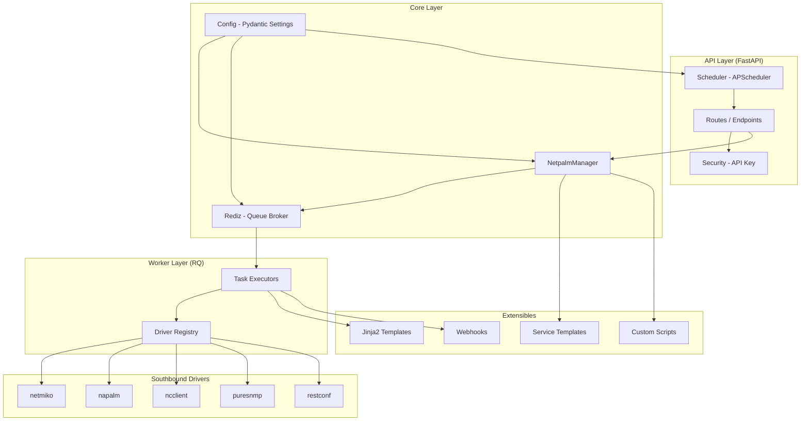
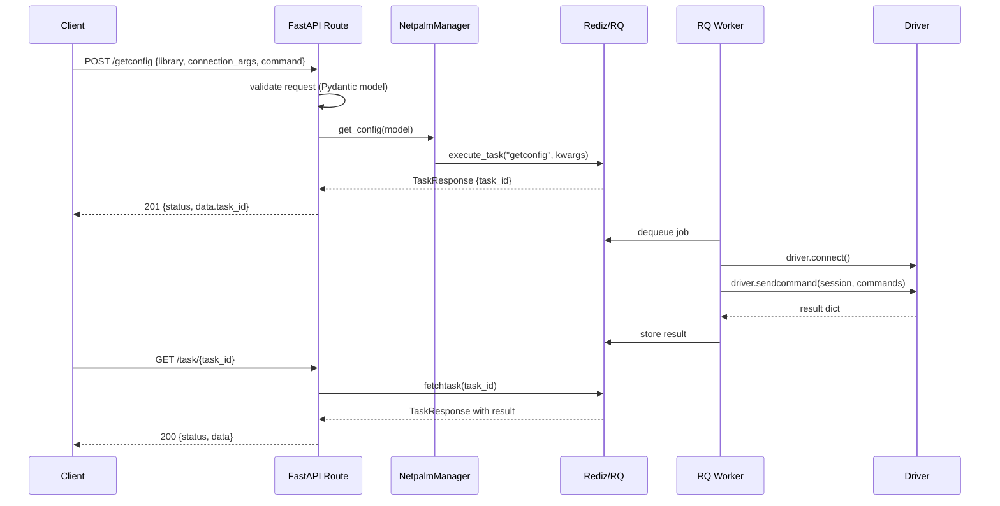

# Design Document: netpalm Modernisation

## Overview

netpalm is an open API platform for network devices that abstracts southbound drivers (napalm, netmiko, ncclient, puresnmp, restconf) behind a unified REST API, using Redis/RQ for async task queuing. The codebase has grown organically and needs a full modernisation pass: strict Python typing throughout, Pydantic v2 models as the single source of truth for all data contracts, removal of dead code, and a cleaner layered architecture that separates concerns more clearly.

The modernisation preserves all existing external API contracts and southbound driver behaviour while replacing the internal plumbing with idiomatic modern Python (3.11+), Pydantic v2, and well-typed interfaces at every layer boundary.

## Architecture



## Sequence Diagrams

### getconfig request flow



## Components and Interfaces

### Config (Pydantic Settings)

**Purpose**: Single source of truth for all application configuration, loaded from JSON files and environment variables.

**Current problem**: Plain class with manual attribute assignment and no type validation. Environment variable handling is fragile.

**Target interface**:
```python
from pydantic_settings import BaseSettings, SettingsConfigDict
from pydantic import field_validator

class NetpalmSettings(BaseSettings):
    model_config = SettingsConfigDict(
        env_prefix="NETPALM_",
        extra="ignore",
    )

    listen_ip: str = "0.0.0.0"
    listen_port: int = 9000
    api_key: SecretStr
    redis_server: str = "localhost"
    redis_port: int = 6379
    redis_key: SecretStr = SecretStr("")
    redis_tls_enabled: bool = False
    redis_task_ttl: int = 500
    redis_task_timeout: int = 500
    redis_task_result_ttl: int = 500
    redis_cache_enabled: bool = False
    redis_cache_default_timeout: int = 300
    drivers: str = "netpalm/backend/plugins/drivers/"

    @field_validator("redis_cache_key_prefix")
    @classmethod
    def ensure_non_empty_prefix(cls, v: str) -> str:
        return v.strip() or "NOPREFIX"
```

**Responsibilities**:
- Load config from `defaults.json`, `config.json`, then env vars (in priority order)
- Validate all values at startup — fail fast on misconfiguration
- Expose a single `get_settings()` function for dependency injection

### NetpalmDriver (Abstract Base)

**Purpose**: Protocol/ABC defining the southbound driver contract.

**Current problem**: Base class uses `raise NotImplementedError` with no type hints; driver names are class attributes set inconsistently.

**Target interface**:
```python
from abc import ABC, abstractmethod
from typing import Any

class NetpalmDriver(ABC):
    driver_name: str  # class-level, required on subclasses

    @abstractmethod
    def connect(self) -> Any:
        """Establish connection; return session object."""

    @abstractmethod
    def sendcommand(self, session: Any, command: list[str]) -> dict[str, Any]:
        """Execute read commands; return {command: result} mapping."""

    @abstractmethod
    def config(self, session: Any, command: str | list[str], **kwargs: Any) -> dict[str, Any]:
        """Push configuration; return {changes: [...]}."""

    @abstractmethod
    def logout(self, session: Any) -> None:
        """Disconnect cleanly."""
```

### Driver Registry

**Purpose**: Discover and register all southbound driver classes at startup.

**Current problem**: `driver_auto_loader()` uses string manipulation and `os.listdir`; no type safety; returns untyped dict.

**Target interface**:
```python
from typing import TypeAlias

DriverMap: TypeAlias = dict[str, type[NetpalmDriver]]

def build_driver_map(driver_dir: str) -> DriverMap:
    """Scan driver_dir, import all NetpalmDriver subclasses, return name->class map."""

def get_driver(name: str, driver_map: DriverMap) -> type[NetpalmDriver]:
    """Retrieve driver class by name; raise DriverNotFoundError if missing."""
```

### Rediz / QueueBroker

**Purpose**: Wraps Redis/RQ to provide task enqueue, fetch, worker management, service instance storage, and caching.

**Current problem**: Monolithic 780-line class mixing queue management, service CRUD, worker control, and caching. Private methods use double-underscore mangling making testing hard. Returns bare `Exception` objects on error instead of raising.

**Target interface**:
```python
class QueueBroker:
    """Handles task enqueue/fetch and worker management only."""

    def enqueue_task(self, queue_name: str, func: Callable, kwargs: dict, ttl: int) -> TaskResponse: ...
    def fetch_task(self, task_id: str) -> TaskResponse: ...
    def get_workers(self) -> list[WorkerResponse]: ...
    def kill_worker(self, worker_name: str) -> None: ...

class ServiceStore:
    """Handles service instance CRUD in Redis."""

    def create(self, service_id: str, data: ServiceInstanceData) -> str: ...
    def fetch(self, service_id: str) -> ServiceInstanceData: ...
    def update(self, service_id: str, data: ServiceInstanceData) -> None: ...
    def delete(self, service_id: str) -> None: ...

class CacheStore:
    """Wraps cachelib RedisCache with typed interface."""

    def get(self, key: str) -> Any | None: ...
    def set(self, key: str, value: Any, ttl: int) -> None: ...
    def poison(self, host_port_key: str) -> bool: ...
```

### NetpalmManager

**Purpose**: Orchestration layer — translates typed request models into queue tasks and returns typed responses.

**Current problem**: Inherits from `Rediz` (tight coupling); mixes orchestration with queue mechanics; uses `.dict(exclude_none=True)` (Pydantic v1 API).

**Target interface**:
```python
class NetpalmManager:
    def __init__(self, broker: QueueBroker, service_store: ServiceStore, cache: CacheStore) -> None: ...

    def get_config(self, request: GetConfig) -> TaskResponse: ...
    def set_config(self, request: SetConfig) -> TaskResponse: ...
    def execute_script(self, request: Script) -> TaskResponse: ...
    def fetch_task(self, task_id: str) -> TaskResponse: ...

    def create_service(self, model: str, request: BaseModel) -> ServiceTaskResponse: ...
    def get_service(self, service_id: str) -> ServiceInstanceData: ...
    def delete_service(self, service_id: str) -> TaskResponse: ...
```

**Responsibilities**:
- Accept Pydantic models, call `broker.enqueue_task()`, return typed responses
- No direct Redis access — delegates to injected dependencies

## Data Models

All models use Pydantic v2. Key migration changes from v1:

- `class Config` inner class → `model_config = ConfigDict(...)`
- `.dict()` → `.model_dump()`
- `.parse_raw()` → `.model_validate_json()`
- `schema_extra` → `json_schema_extra`
- `__root__` models → `RootModel[T]`
- `Optional[X]` with no default → `X | None = None`

### Core Request Models

```python
from pydantic import BaseModel, ConfigDict
from enum import Enum
from typing import Any

class LibraryName(str, Enum):
    napalm = "napalm"
    ncclient = "ncclient"
    restconf = "restconf"
    netmiko = "netmiko"
    puresnmp = "puresnmp"

class QueueStrategy(str, Enum):
    fifo = "fifo"
    pinned = "pinned"

class CacheConfig(BaseModel):
    enabled: bool = False
    ttl: int | None = None
    poison: bool = False

class GetConfig(BaseModel):
    model_config = ConfigDict(json_schema_extra={...})

    library: LibraryName
    connection_args: dict[str, Any]
    command: str | list[str]
    args: dict[str, Any] | None = None
    webhook: Webhook | None = None
    queue_strategy: QueueStrategy | None = None
    post_checks: list[GenericPrePostCheck] | None = None
    cache: CacheConfig = CacheConfig()
```

### Task Response Models

```python
from datetime import datetime
from typing import Any, Literal
from enum import Enum

class TaskStatus(str, Enum):
    queued = "queued"
    started = "started"
    finished = "finished"
    failed = "failed"

class TaskMeta(BaseModel):
    enqueued_at: datetime | None = None
    started_at: datetime | None = None
    ended_at: datetime | None = None
    enqueued_elapsed_seconds: int | None = None
    total_elapsed_seconds: int | None = None
    assigned_worker: str | None = None

class TaskError(BaseModel):
    exception_class: str
    exception_args: list[str]

class TaskResponse(BaseModel):
    task_id: str
    created_on: datetime
    task_queue: str
    task_meta: TaskMeta | None = None
    task_status: TaskStatus
    task_result: Any
    task_errors: list[str | TaskError]

class Response(BaseModel):
    status: Literal["success", "error"]
    data: TaskResponse
```

### Service Models

```python
class ServiceInstanceState(str, Enum):
    deployed = "deployed"
    errored = "errored"
    deploying = "deploying"

class ServiceMeta(BaseModel):
    service_model: str
    created_at: datetime
    updated_at: datetime | None = None
    service_id: str
    service_state: ServiceInstanceState | None = None

class ServiceInstanceData(BaseModel):
    service_meta: ServiceMeta
    service_data: Any

# Removed: ServiceLifecycle, ServiceModel, ServiceModelMethods,
# ServiceModelSupportedMethods, ServiceModelTemplate (all marked redundant)
```

## Key Functions with Formal Specifications

### exec_command

```python
def exec_command(
    library: str,
    connection_args: dict[str, Any],
    command: str | list[str],
    args: dict[str, Any] | None,
    post_checks: list[PostCheck] | None,
    webhook: Webhook | None,
    **kwargs: Any,
) -> dict[str, Any]:
```

**Preconditions**:
- `library` is a key in the driver registry
- `connection_args` contains at minimum `host`, `username`, `password`
- `command` is a non-empty string or non-empty list of strings

**Postconditions**:
- Returns `{command_str: result}` mapping for each command
- If `post_checks` provided and any check fails, raises `NetpalmCheckError` before returning
- If `webhook` provided, fires webhook with result after successful execution
- On any driver exception, raises typed `DriverCommandError` (no silent swallowing)

**Loop invariants** (post_checks loop):
- All previously validated checks passed
- Session remains open throughout check loop

### exec_config

```python
def exec_config(
    library: str,
    connection_args: dict[str, Any],
    config: str | list[str] | None,
    j2config: J2Config | None,
    pre_checks: list[PreCheck] | None,
    post_checks: list[PostCheck] | None,
    enable_mode: bool,
    webhook: Webhook | None,
    **kwargs: Any,
) -> dict[str, Any]:
```

**Preconditions**:
- Exactly one of `config` or `j2config` is provided
- `library` is registered in driver map

**Postconditions**:
- Returns `{"changes": [...]}` on success
- Pre-checks run before config push; failure raises `NetpalmCheckError` and aborts push
- Post-checks run after config push; failure raises `NetpalmCheckError`
- Cache for `host:port` is poisoned on successful config push

### build_driver_map

```python
def build_driver_map(driver_dir: str) -> DriverMap:
```

**Preconditions**:
- `driver_dir` is a valid directory path
- Each subdirectory contains at most one `NetpalmDriver` subclass per `.py` file

**Postconditions**:
- Returns dict mapping `driver_name -> driver_class` for all discovered drivers
- Raises `DriverLoadError` with details if any driver fails to import
- All returned classes satisfy `issubclass(cls, NetpalmDriver)`

### NetpalmSettings.load

```python
@classmethod
def load(cls, config_path: str | None = None) -> "NetpalmSettings":
```

**Preconditions**:
- At least one of `defaults.json` or `config.json` is readable

**Postconditions**:
- Returns fully validated `NetpalmSettings` instance
- `defaults.json` values are overridden by `config.json`, which are overridden by `NETPALM_*` env vars
- Raises `ValidationError` on first invalid value (fail-fast)

## Algorithmic Pseudocode

### Task Execution Pipeline

```pascal
ALGORITHM execute_task(method, kwargs)
INPUT: method: str, kwargs: dict
OUTPUT: TaskResponse

BEGIN
  ASSERT method IN routes
  ASSERT kwargs IS well-formed dict

  queue_strategy ← kwargs.get("queue_strategy", "fifo")
  host ← kwargs.connection_args.get("host", null)

  IF queue_strategy = "pinned" AND host IS NOT null THEN
    queue_name ← host
    CALL ensure_pinned_worker_exists(queue_name)
  ELSE
    queue_name ← config.redis_fifo_q
  END IF

  meta ← {errors: [], enqueued_elapsed_seconds: null, total_elapsed_seconds: null}
  job ← rq_queue[queue_name].enqueue(routes[method], kwargs=kwargs, meta=meta, ttl=ttl)

  ASSERT job.id IS NOT null

  RETURN render_task_response(job)
END
```

### Driver Execution with Pre/Post Checks

```pascal
ALGORITHM exec_config_with_checks(driver, session, config, pre_checks, post_checks)
INPUT: driver: NetpalmDriver, session: Any, config: str, pre_checks: list, post_checks: list
OUTPUT: result: dict

BEGIN
  // Pre-check phase
  FOR each check IN pre_checks DO
    ASSERT all_previous_checks_passed = true
    cmd_result ← driver.sendcommand(session, [check.command])
    FOR each match_str IN check.match_str DO
      IF check.match_type = "include" AND match_str NOT IN cmd_result THEN
        RAISE NetpalmCheckError("PreCheck Failed: " + match_str)
      END IF
      IF check.match_type = "exclude" AND match_str IN cmd_result THEN
        RAISE NetpalmCheckError("PreCheck Failed: " + match_str)
      END IF
    END FOR
  END FOR

  // Config push
  result ← driver.config(session, config)
  ASSERT result CONTAINS "changes"

  // Post-check phase
  FOR each check IN post_checks DO
    ASSERT config_was_pushed = true
    cmd_result ← driver.sendcommand(session, [check.command])
    FOR each match_str IN check.match_str DO
      IF check.match_type = "include" AND match_str NOT IN cmd_result THEN
        RAISE NetpalmCheckError("PostCheck Failed: " + match_str)
      END IF
    END FOR
  END FOR

  RETURN result
END
```

### Config Loading with Priority Merge

```pascal
ALGORITHM load_settings(defaults_path, config_path)
INPUT: defaults_path: str, config_path: str
OUTPUT: NetpalmSettings

BEGIN
  data ← {}

  IF file_exists(defaults_path) THEN
    data.update(json_load(defaults_path))
  END IF

  IF file_exists(config_path) THEN
    data.update(json_load(config_path))
  END IF

  IF data IS EMPTY THEN
    RAISE RuntimeError("No config files found")
  END IF

  // pydantic-settings handles NETPALM_* env var overrides automatically
  settings ← NetpalmSettings(**data)

  ASSERT settings.api_key IS NOT EMPTY
  ASSERT settings.redis_port IN [1, 65535]

  RETURN settings
END
```

## Example Usage

```python
# Dependency injection setup (app factory)
from functools import lru_cache
from netpalm.backend.core.confload import get_settings
from netpalm.backend.core.redis.broker import QueueBroker
from netpalm.backend.core.redis.service_store import ServiceStore
from netpalm.backend.core.manager.netpalm_manager import NetpalmManager

@lru_cache
def get_manager() -> NetpalmManager:
    settings = get_settings()
    broker = QueueBroker(settings)
    store = ServiceStore(broker.base_connection)
    return NetpalmManager(broker=broker, service_store=store)

# Route handler — typed, no raw dicts
@router.post("/getconfig", response_model=Response, status_code=201)
async def getconfig(
    request: GetConfig,
    manager: NetpalmManager = Depends(get_manager),
    _: str = Depends(get_api_key),
) -> Response:
    return manager.get_config(request)

# Driver implementation — typed
class NetmikoDriver(NetpalmDriver):
    driver_name = "netmiko"

    def __init__(
        self,
        connection_args: dict[str, Any],
        args: dict[str, Any] | None = None,
        **kwargs: Any,
    ) -> None:
        self.connection_args = connection_args
        self.args = args or {}

    def connect(self) -> BaseConnection:
        return ConnectHandler(**self.connection_args)

    def sendcommand(self, session: BaseConnection, command: list[str]) -> dict[str, Any]:
        return {cmd: session.send_command(cmd, **self.args) for cmd in command}

    def config(self, session: BaseConnection, command: str | list[str], **kwargs: Any) -> dict[str, Any]:
        cmds = command if isinstance(command, list) else command.splitlines()
        response = session.send_config_set(cmds)
        return {"changes": response.splitlines()}

    def logout(self, session: BaseConnection) -> None:
        session.disconnect()
```

## Error Handling

### Current Problems

- Driver methods catch `Exception` broadly, call `write_meta_error(e)`, then return `None` or `False` — callers cannot distinguish error from empty result
- `Rediz` methods return `Exception` objects instead of raising them
- No custom exception hierarchy

### Target Exception Hierarchy

```python
class NetpalmError(Exception):
    """Base for all netpalm errors."""

class DriverNotFoundError(NetpalmError):
    """Requested driver is not registered."""

class DriverConnectionError(NetpalmError):
    """Failed to connect to device."""

class DriverCommandError(NetpalmError):
    """Command execution failed on device."""

class NetpalmCheckError(NetpalmError):
    """Pre/post check assertion failed."""

class ServiceNotFoundError(NetpalmError):
    """Service instance does not exist."""

class ConfigurationError(NetpalmError):
    """Application misconfiguration at startup."""
```

### Error Handling Strategy

- Driver methods raise typed exceptions; callers decide whether to catch or propagate
- RQ worker catches exceptions, writes structured `TaskError` to job meta, marks job as failed
- FastAPI exception handlers translate `NetpalmError` subclasses to appropriate HTTP status codes
- `write_meta_error` replaced by structured error recording via typed `TaskError` model

## Testing Strategy

### Unit Testing

- Each driver tested in isolation with mocked `ConnectHandler` / `napalm.get_network_driver`
- `NetpalmManager` tested with mocked `QueueBroker` and `ServiceStore`
- `NetpalmSettings` tested with temporary JSON files and env var overrides
- `exec_command` / `exec_config` tested with mock driver instances

### Property-Based Testing

**Property Test Library**: `hypothesis`

Key properties to verify:
- `NetpalmSettings` round-trips: any valid settings dict serialises and deserialises to identical values
- Pre/post check logic: for any combination of `match_type` and `match_str`, check outcome is deterministic
- Task response rendering: any valid RQ job state produces a valid `TaskResponse` model
- Driver map: loading the same driver directory twice always produces identical maps

### Integration Testing

- Redis integration tests using `fakeredis` for queue and cache behaviour
- Full request → worker → result cycle tested with `fakeredis` and mock drivers
- Service lifecycle (create → retrieve → update → delete) tested end-to-end

## Performance Considerations

- `get_settings()` cached with `@lru_cache` — config parsed once per process
- Driver map built once at startup, stored as module-level singleton
- Pydantic v2 is significantly faster than v1 for model validation — no performance regression expected
- `model_dump(exclude_none=True)` replaces `.dict(exclude_none=True)` — same semantics, faster execution

## Security Considerations

- `ScrubFilter` log scrubbing retained and extended to cover all sensitive field names via a typed allowlist
- `NetpalmSettings` fields for `api_key` and `redis_key` use `SecretStr` to prevent accidental logging
- Credential scrubbing in `fetch_service_instance_args` moved to a dedicated `scrub_credentials(data: dict) -> dict` utility with explicit field paths
- TLS config validated at startup — missing cert files raise `ConfigurationError` immediately rather than silently continuing

## Dependencies

**Retained**:
- `fastapi`, `uvicorn`, `gunicorn` — API server
- `redis`, `rq`, `redis-lock` — queue and locking
- `pydantic` (upgrade to v2) — models and validation
- `napalm`, `netmiko`, `ncclient`, `puresnmp`, `requests` — southbound drivers
- `apscheduler` — job scheduling
- `jinja2` — template rendering
- `textfsm`, `ttp` — output parsing
- `cachelib` — response caching

**Added**:
- `pydantic-settings` — replaces manual env var handling in `confload.py`
- `hypothesis` — property-based testing (dev dependency)

**Removed / Replaced**:
- Manual `os.getenv` loops in `confload.py` — replaced by `pydantic-settings`
- `jsonable_encoder` calls in manager — replaced by `.model_dump()` on typed responses
- Dead service model classes (`ServiceLifecycle`, `ServiceModel`, `ServiceModelMethods`, `ServiceModelSupportedMethods`, `ServiceModelTemplate`) — all marked redundant in existing code, to be deleted
